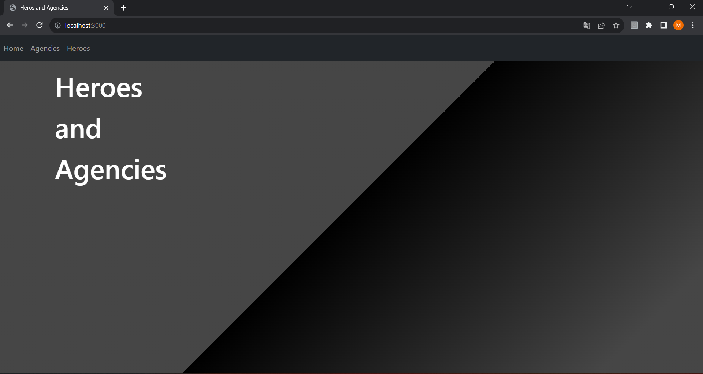
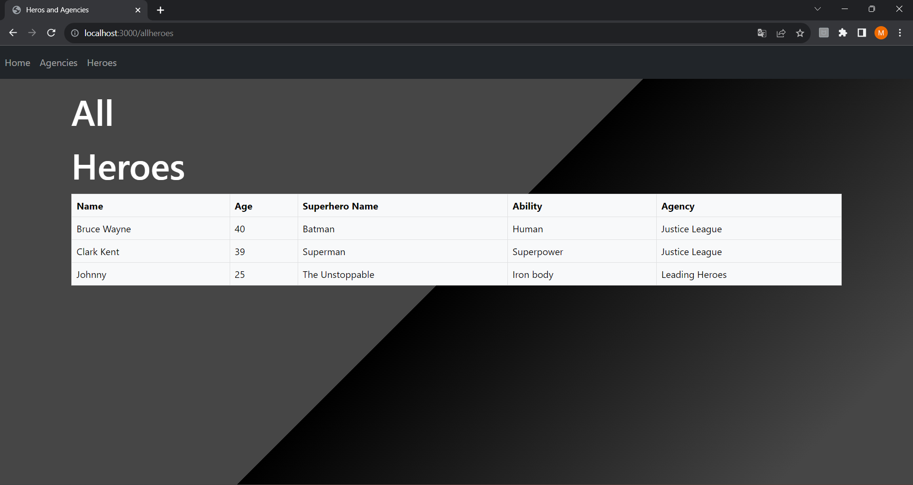
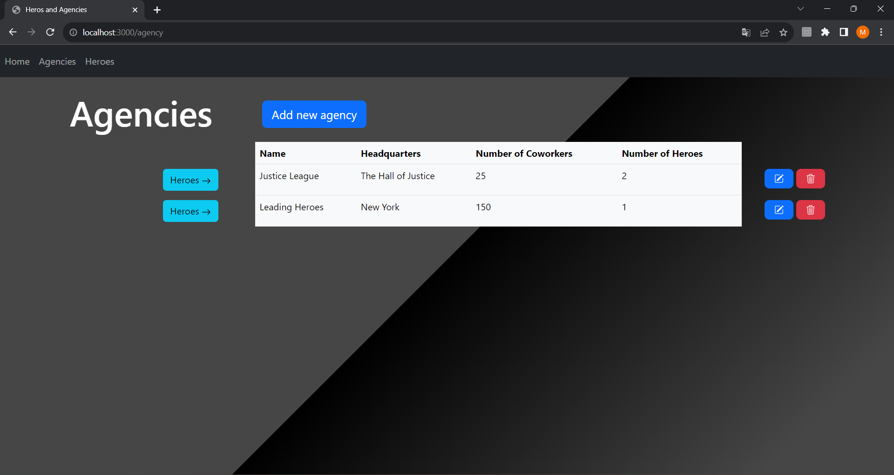
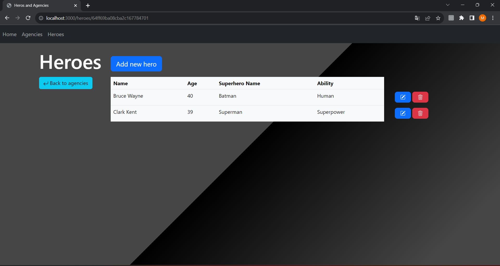
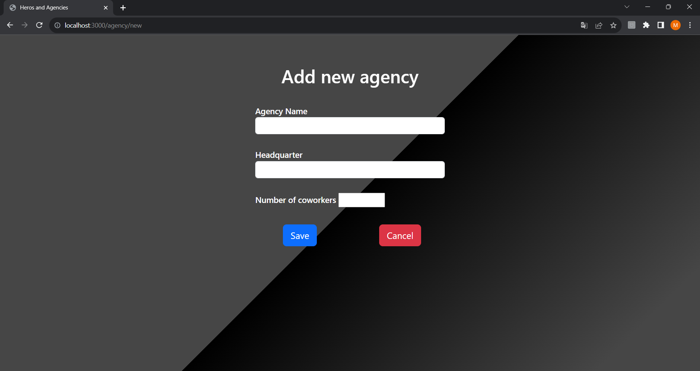

# Nodejs webapp

Egy egyszerű frontend egy adatbázissal a háttérben, ejs, javascript és mongoDB segítségével.

Lényege egy nyilvántartó rendszer megvalósítása, minimum 2 összekapcsolódó egyeddel. Jelen esetben a 2 egyed a hősők és az őket összesítő és besoroló ügynökségek. 2 egyed között egy-több kapcsolat van, azaz 1 ügynökséghez egyszerre több hős is tartozhat, fordítva nem.

## Nézetek/Funkciók

Indításkor a felhasználót egy home page fogadja. Onnan navigation bar használával lehet a nézetek között váltogatni: vagy az ügynökségeket vagy az adatbázisban lévő összes hőst itt lehet megtekinteni egyszerre.

Az egyes ügynökségekhez tartozó hősöket az agencies táblából kiindulva, az adott ügynökség mellett lévő gomb segítségével lehet megtekinteni. Új elem felvétele az adatbázisba, vagy a meglévők adatainak módosítása az add/edit gombok használatával lehetséges. Természetesen tetszőleges elemeket el is lehet távolítani, ha azt szeretnénk. Egy ügynökség törlése esetén a hozzá tartozó összes hős is törlődik az adatbázisból.

